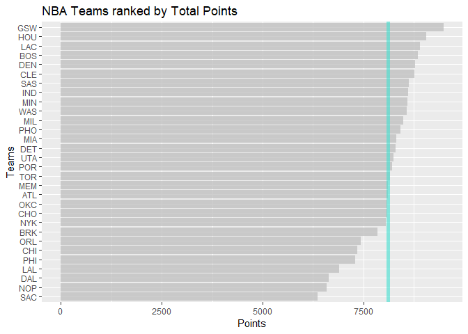
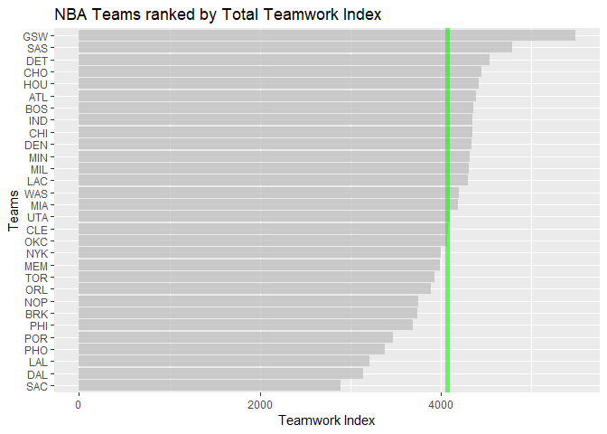

workout01-angela-fang
================
Angela Fang
October 1, 2018

Ranking 2018 NBA Teams
======================

Before we begin with making our graphics, let us first load the data set that we will be using:

``` r
df <- read.csv("../data/nba2018-teams.csv", stringsAsFactors = FALSE)
```

The first visual that we will create is one that ranks NBA team salaries against each other:

``` r
ggplot(df,aes(x=reorder(team,salary), y=salary))+
  geom_bar(stat='identity', alpha=0.75, fill="grey")+
  coord_flip()+
  labs(y="Salary (in millions)", x="Teams", title="NBA Teams ranked by Total Salary")+
  geom_hline(aes(yintercept=mean(df$salary)), color="coral", size=2, alpha=0.6)
```


We ordered the teams based on their player aggregate salary. The vertical line signals the average across all team salaries. Based on this chart, PHI (*) would be ranked last, and CLE (*) would be ranked first. However, the graphic above is only one way of ranking the teams. We can also look from a different angle and use their aggregate points to evaluate their relative rankings:

``` r
ggplot(df,aes(x=reorder(team,points), y=points))+
  geom_bar(stat='identity', alpha=0.75, fill="grey")+
  coord_flip()+
  labs(y="Points", x="Teams", title="NBA Teams ranked by Total Points")+
  geom_hline(aes(yintercept=mean(df$points)), color="turquoise", size=2, alpha=0.6)
```



Depending on how we measure the teams, their rankings change. The visual above ranks SAC (*) as last and GSW(*) as first, as opposed to the first graphic. The vertical line here displays the average total points across teams as a reference point. We can further validate our point by evaluating the teams with another metric. Using the efficiency index, we can too evaluate the teams:

``` r
ggplot(df,aes(x=reorder(team,efficiency), y=efficiency))+
  geom_bar(stat='identity', alpha=0.75, fill="grey")+
  coord_flip()+
  labs(y="Efficiency Index", x="Teams", title="NBA Teams ranked by Total Efficiency Index")+
  geom_hline(aes(yintercept=mean(df$efficiency)), color="gold", size=2, alpha=0.6)
```


Here we see again that the rankings change. Based on team efficiency index, CLE (*) is ranked first, and LAL (*) is ranked last.

Let us see what happens when we apply our own ranking equation. We can focus on actions that benefit or set back the team to measure teamwork. Adding beneficial actions and subtracting unhelpful actions, we get:

``` r
df <- mutate(df,
             teamwork=off_rebounds+def_rebounds+steals+assists+steals+blocks-
                                     turnovers-fouls)
```

``` r
ggplot(df,aes(x=reorder(team,teamwork), y=teamwork))+
  geom_bar(stat='identity', alpha=0.75, fill="grey")+
  coord_flip()+
  labs(y="Teamwork Index", x="Teams", title="NBA Teams ranked by Total Teamwork Index")+
  geom_hline(aes(yintercept=mean(df$teamwork)), color="green", size=2, alpha=0.6)
```



With this index that we created, GSW (Golden State Warriors) is again ranked top, and SAC (\_) is not ranked bottom.

Comments and Reflections
========================

-   Not really familiar with basketball, so had to do some research to create an index that made sense
-   Still not really great with github. Linking the repositories was a bit troublesome
-   Started out working with R via script. Definitely a lot easier as it doesn't need a narrative to go along with it (although in the past I've been the only one to use my own script)
-   Out of all my assignments this actually took the least time
